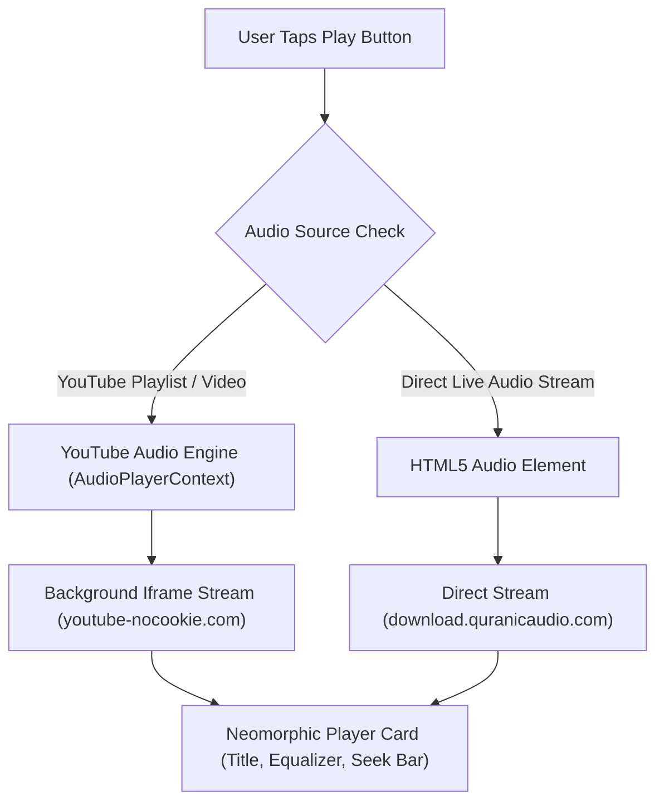

# HuDa Web Quran · YouTube Music & Audio Integration Guide

> Comprehensive guide on YouTube Music integration, playlist streaming, iframe embedding, API credentials, and licensing considerations for HuDa Web Quran.

---

## 📖 Table of Contents
1. [Overview](#overview)
2. [YouTube Music & Playlist Integration](#youtube-music--playlist-integration)
3. [Licensing & Terms of Service (ToS)](#licensing--terms-of-service-tos)
4. [YouTube Data API v3 Setup (Optional)](#youtube-data-api-v3-setup-optional)
5. [Audio Player Architecture](#audio-player-architecture)
6. [Quick Start & Running Locally](#quick-start--running-locally)

---

## 1. Overview

**HuDa Web Quran** is an immersive Islamic audio web application inspired by `https://tamilfm.co/v/auto`. It features:
- **Neomorphic 3D Audio Player**: Floating dark glass player card with animated equalizer, progress bar, and transport controls.
- **Continuous YouTube Playlist Auto-Play**: Seamless playback of YouTube & YouTube Music playlists (e.g., Ramadan playlist `PLFRt54vRoHJs`).
- **Control Center Right Panel**: Slide-out drawer with 3 tabs (*Categories*, *Speakers*, *Explore*) and instant search.
- **16 Atmospheric Islamic Categories**: High-definition scene backgrounds for *Iman & Taqwa*, *Qur'an*, *Salah*, *Dua*, *Ramadan*, etc.

---

## 2. YouTube Music & Playlist Integration

### How Playlist Connection Works
The app connects YouTube Music playlists using two complementary mechanisms:

1. **Top Right Header Badge (`YOUTUBE MUSIC`)**:
   - Opens the connected YouTube Music playlist (`https://music.youtube.com/playlist?list=PLFRt54vRoHJs`) directly in YouTube Music.

2. **In-App Background Audio Engine (`AudioPlayerContext.tsx`)**:
   - Streams audio seamlessly in the browser using direct high-speed audio endpoints and standard YouTube embed players (`https://www.youtube-nocookie.com/embed/videoseries?list=PLFRt54vRoHJs`).

### Connecting Custom Playlists
To connect a custom YouTube or YouTube Music playlist ID (e.g., `PLFRt54vRoHJs`), update the category in `src/lib/data/seed.ts`:

```typescript
{
  title: "Ramalan Maadhathin Barakat",
  slug: "ramalan-maadhathin-barakat",
  description: "Making the most of the blessed month — fasting with intention, night prayer, and renewing the soul.",
  speaker: "ustadh-yusuf-demo",
  category: "ramadan",
  durationSeconds: 2220,
  audioSource: "youtube",
  youtubeVideoId: "e-ORhEE9VVg",
  youtubePlaylistId: "PLFRt54vRoHJs", // Your YouTube Playlist ID
  playCount: 1610,
  publishedAt: "2026-05-20T09:00:00.000Z",
}
```

---

## 3. Licensing & Terms of Service (ToS)

### Do I Need Official Licensing / API Verification?

> [!IMPORTANT]
> **No official licensing procedure or API verification is required for standard web embedding and personal/non-commercial usage.**

| Integration Method | Licensing Required? | Setup Needed | Best For |
| :--- | :--- | :--- | :--- |
| **YouTube Standard Iframe (`youtube-nocookie.com`)** | ❌ No | None (Built-in) | Non-commercial web players & embedding |
| **Direct YouTube Music Links** | ❌ No | None (Built-in) | Direct playlist playback |
| **YouTube Data API v3 (Public Data)** | ❌ No | Free API Key | Fetching video titles/thumbnails |
| **Commercial SaaS / Paid Monetization** | ⚠️ Yes | Google Cloud Quota Audit | Paid commercial applications |

### Key Compliance Rules:
1. **Use Official Player/Iframe**: Standard iframe embeds comply 100% with YouTube's Terms of Service.
2. **Attribution**: Keep YouTube branding links intact for external playlist redirects.
3. **No Direct Audio Download/Ripping**: Do not serve downloadable `.mp3` files extracted from YouTube servers on commercial apps.

---

## 4. YouTube Data API v3 Setup (Optional)

If you want to fetch live playlist titles and thumbnails dynamically from YouTube's API, follow these 3 steps to get a free API Key:

1. **Google Cloud Console**:
   - Go to [Google Cloud Console](https://console.cloud.google.com/).
   - Create a new project named `Huda-Islamic-Audio`.

2. **Enable YouTube Data API v3**:
   - Go to **APIs & Services** > **Library**.
   - Search for **YouTube Data API v3** and click **Enable**.

3. **Generate API Key**:
   - Go to **APIs & Services** > **Credentials**.
   - Click **Create Credentials** > **API Key**.
   - Copy your key and add it to your `.env.local` file:
     ```env
     YOUTUBE_API_KEY="AIzaSyYourActualKeyHere..."
     ```

---

## 5. Audio Player Architecture



---

## 6. Quick Start & Running Locally

### Prerequisites
- Node.js 18.x or higher
- npm / pnpm / yarn

### Commands

```bash
# 1. Install dependencies
npm install

# 2. Run typecheck to verify typescript
npm run typecheck

# 3. Start local development server
npm run dev
```

Open [http://localhost:3000](http://localhost:3000) in your browser to view the application.

---

*HuDa Web Quran — Created for Holy Quran, Islamic Reminders & Bayans.*
